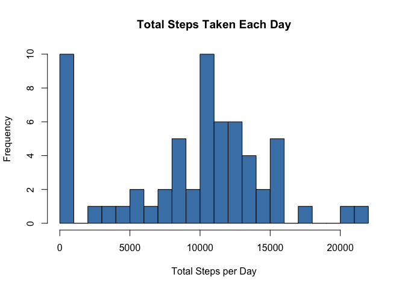
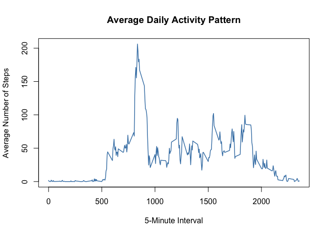
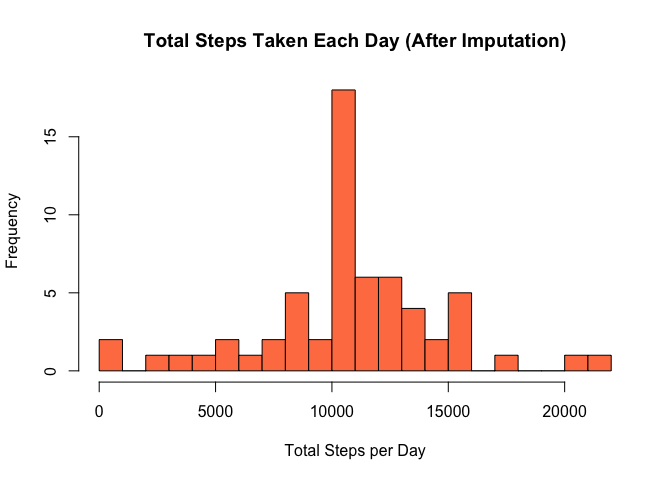
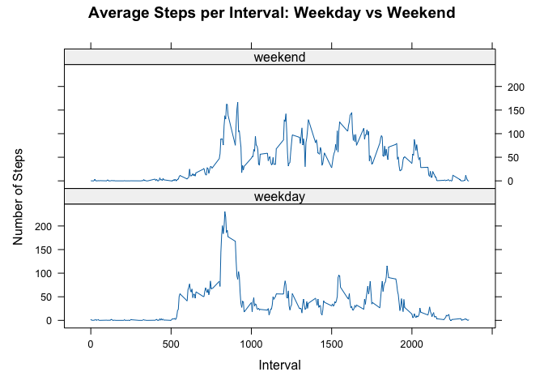

## Loading and preprocessing the data


``` r
# Unzip the data file if the CSV is not already present
if (!file.exists("activity.csv")) {
  unzip("repdata_data_activity.zip")
}

# Load the data
activity <- read.csv("activity.csv")

# Convert date from character to Date type
activity$date <- as.Date(activity$date, "%Y-%m-%d")

str(activity)
```

```
## 'data.frame':	17568 obs. of  3 variables:
##  $ steps   : int  NA NA NA NA NA NA NA NA NA NA ...
##  $ date    : Date, format: "2012-10-01" "2012-10-01" ...
##  $ interval: int  0 5 10 15 20 25 30 35 40 45 ...
```

``` r
head(activity)
```

```
##   steps       date interval
## 1    NA 2012-10-01        0
## 2    NA 2012-10-01        5
## 3    NA 2012-10-01       10
## 4    NA 2012-10-01       15
## 5    NA 2012-10-01       20
## 6    NA 2012-10-01       25
```

---

## What is the mean total number of steps taken per day?

*Missing values are ignored for this section.*

**1. Total steps taken per day:**


``` r
steps_per_day <- tapply(activity$steps, activity$date, sum, na.rm = TRUE)
```

**2. Histogram of total steps per day:**


``` r
hist(steps_per_day,
     main   = "Total Steps Taken Each Day",
     xlab   = "Total Steps per Day",
     ylab   = "Frequency",
     col    = "steelblue",
     breaks = 20)
```

<!-- -->

**3. Mean and median of total steps per day:**


``` r
mean_steps   <- mean(steps_per_day)
median_steps <- median(steps_per_day)

cat("Mean steps per day:  ", round(mean_steps, 2), "\n")
```

```
## Mean steps per day:   9354.23
```

``` r
cat("Median steps per day:", median_steps, "\n")
```

```
## Median steps per day: 10395
```

The **mean** total number of steps taken per day is **9354.23**
and the **median** is **10395**.

---

## What is the average daily activity pattern?

**1. Time series plot of average steps per 5-minute interval:**


``` r
avg_by_interval <- tapply(activity$steps, activity$interval, mean, na.rm = TRUE)

interval_df <- data.frame(
  interval  = as.integer(names(avg_by_interval)),
  avg_steps = as.numeric(avg_by_interval)
)

plot(interval_df$interval, interval_df$avg_steps,
     type = "l",
     main = "Average Daily Activity Pattern",
     xlab = "5-Minute Interval",
     ylab = "Average Number of Steps",
     col  = "steelblue",
     lwd  = 1.5)
```

<!-- -->

**2. Which 5-minute interval, on average, contains the maximum number of steps?**


``` r
max_interval <- interval_df$interval[which.max(interval_df$avg_steps)]
max_steps_val <- round(max(interval_df$avg_steps), 2)

cat("Interval with maximum average steps:", max_interval, "\n")
```

```
## Interval with maximum average steps: 835
```

``` r
cat("Average steps in that interval:     ", max_steps_val, "\n")
```

```
## Average steps in that interval:      206.17
```

Interval **835** contains the maximum average number of steps
(**206.17** steps on average across all days).

---

## Imputing missing values

**1. Total number of missing values in the dataset:**


``` r
total_na <- sum(is.na(activity$steps))
cat("Total rows with NA steps:", total_na, "\n")
```

```
## Total rows with NA steps: 2304
```

There are **2304** missing values (rows where `steps` is `NA`).

**2. Strategy for filling in missing values:**

Each `NA` is replaced with the **mean number of steps for that 5-minute interval**,
computed across all days. This is reasonable because the pattern of activity within
a day (e.g. low at night, higher in the morning) is more predictable than day-to-day
variation.

**3. New dataset with missing values filled in:**


``` r
activity_imputed <- activity

for (i in seq_len(nrow(activity_imputed))) {
  if (is.na(activity_imputed$steps[i])) {
    this_interval <- as.character(activity_imputed$interval[i])
    activity_imputed$steps[i] <- avg_by_interval[this_interval]
  }
}

# Confirm no NAs remain
cat("Missing values remaining after imputation:", sum(is.na(activity_imputed$steps)), "\n")
```

```
## Missing values remaining after imputation: 0
```

**4. Histogram, mean and median after imputation — and comparison to original estimates:**


``` r
steps_per_day_imp <- tapply(activity_imputed$steps, activity_imputed$date, sum)

hist(steps_per_day_imp,
     main   = "Total Steps Taken Each Day (After Imputation)",
     xlab   = "Total Steps per Day",
     ylab   = "Frequency",
     col    = "coral",
     breaks = 20)
```

<!-- -->

``` r
mean_imp   <- mean(steps_per_day_imp)
median_imp <- median(steps_per_day_imp)

cat("Mean steps per day (imputed):  ", round(mean_imp, 2), "\n")
```

```
## Mean steps per day (imputed):   10766.19
```

``` r
cat("Median steps per day (imputed):", round(median_imp, 2), "\n")
```

```
## Median steps per day (imputed): 10766.19
```

| Metric | Before Imputation | After Imputation |
|--------|:-----------------:|:----------------:|
| Mean   | 9354.23 | 1.076619\times 10^{4} |
| Median | 10395         | 1.076619\times 10^{4} |

**Do these values differ from the first part of the assignment?**
Yes. Both the mean and median are higher after imputation. Before imputation,
days with all `NA` values were treated as having 0 total steps, pulling the mean
and median down. After filling in those days with interval means, those days now
have a realistic total (~10,766 steps), which raises both statistics.

**What is the impact of imputing missing data on the estimates of total daily steps?**
The total daily step counts become more normally distributed (the histogram is
more symmetric and bell-shaped). The large bar at 0 in the original histogram
disappears, and the central peak around 10,000–11,000 steps becomes taller.
This shows that ignoring NAs (treating them as 0) underestimated typical daily
activity.

---

## Are there differences in activity patterns between weekdays and weekends?

*Using the imputed dataset for this section.*

**1. Create a new factor variable: weekday vs weekend:**


``` r
activity_imputed$day_type <- ifelse(
  weekdays(activity_imputed$date) %in% c("Saturday", "Sunday"),
  "weekend",
  "weekday"
)
activity_imputed$day_type <- factor(activity_imputed$day_type,
                                    levels = c("weekday", "weekend"))

table(activity_imputed$day_type)
```

```
## 
## weekday weekend 
##   12960    4608
```

**2. Panel plot: average steps per 5-minute interval for weekdays vs weekends:**


``` r
library(lattice)

avg_by_daytype <- aggregate(steps ~ interval + day_type,
                            data = activity_imputed,
                            FUN  = mean)

xyplot(steps ~ interval | day_type,
       data   = avg_by_daytype,
       type   = "l",
       layout = c(1, 2),
       xlab   = "Interval",
       ylab   = "Number of Steps",
       main   = "Average Steps per Interval: Weekday vs Weekend")
```

<!-- -->

**Are there differences in activity patterns between weekdays and weekends?**
Yes, there are clear differences:

- On **weekdays**, activity spikes sharply in the morning around interval 835
  (~8:35 AM), likely due to commuting or a morning workout, then drops and
  stays low for the rest of the day — consistent with sitting at a desk.
- On **weekends**, activity is more evenly spread throughout the day with no
  single dominant peak, and overall daytime step counts are higher, suggesting
  a more active lifestyle when not constrained by work hours.
